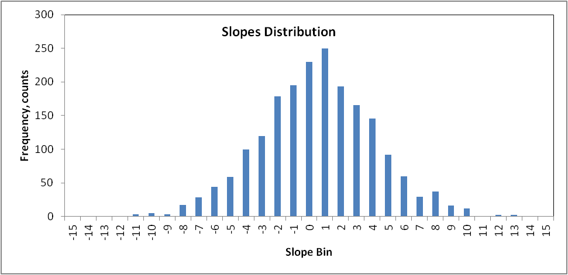

## Motion Detection with an HC-SR04 ultrasonic sensor: Issues, Statistics, and Thoughts 

Gary Drykacz, November, 2020

**Introduction**

The project goal was to explore using a programmable LED strip as a
visual aid to guide a vehicle into a specifically defined area within a
garage. Two sensor would be used, one pointed at the front of the car,
and the second laterally on the side wall. The forward sensor would
change the LED strip color based on distance to the garage back wall,
and the led pattern would shift left, right or from edges to center in
traveling waves, based on the side sensor.

We have a two car garage, with a relatively narrow "bay" for each car.
If one car is parked too close to the edge of its bay, the driver of the
other vehicle may not be able to easily get in or out of their car. In
addition, it would be nice, but less critical, to have a well-defined
consistent front stopping area. Of course, it was not practical to have
the LED lights on continuously, so there are two criteria to analyze,
motion and distance.

To be honest, long familiarity with parking the car in the garage worked
fine, and an "upgrade" to a cheap, commercial, laser position device
that projected a laser dot on the car also helped. The problem with the
latter is that it showed too late to really position the car earlier in
parking. Of course, there is the tried and true, cheap ball and string
indicator, as well as other electronic methods to indicate final car
position, but this more refined idea peaked my interest.

To jump to the project conclusion, the project as originally envisioned
failed. The reasons for the failure where not the project concept, but a
naive understanding of the ultrasonic echo response from the front
bumper and grill of a modern vehicle, along with an unforeseen
relationship of our driveway configuration with respect to the garage
entryway. The latter problem was connected with misleading information
on the HC-SR04 beam spread angle.

Even the vehicle with the least aerodynamic front was not capable of
returning an echo with sufficient energy back to the sensor microphone
to trigger a response, except at distances just over 2 meters.

Our driveway is "L" shaped with a tight turn into the garage. I thought
the detection spread of the sensor would be sufficient to compensate for
the angle in which the cars enter the garage. That assumption was overly
optimistic. It was not until very late in the project I had access to
laptop to monitor a vehicle entering the garage. A few tests quickly
showed that the project in its original formulation was a non starter.
Anyone anticipating a similar project, with curved entry path close to
the garage entrance will likely have the same issues. For some vehicles
and some driveway configurations, the original idea might work, but it
is doubtful.

With a failure of the project, why even bother going into a very lengthy
discussion of results? Four reasons:

1.  Those wishing to do something similar, may realize the pitfalls to
    overcome.

2.  Measuring motion, particular when the velocity may vary, is not the
    same as measuring distance, there are more considerations. Anyone
    needing to monitor motion and position in a project, may find the
    discussion here a useful starting point.

3.  Sometimes failures can be just as useful as positive results.

4.  Along the way on this project, I learned some interesting facts on
    how the sensor senses return echoes that might clear up some other
    information found online.

First, let's look at some general considerations of sensors that will
affect this kind of project, Every sensor has an envelope of
characteristics to negotiate for optimal use. For measuring distance and
motion, we have several characteristics that need to be maneuvered
through to find the best fit for a project:

  - Lower and upper distance limits of detection,

  - Error limits of individual measurements,

  - Data repetition rate, i.e., intervals between readings versus total
    time of monitoring,

  - Velocity difference between the sensor and target object,

  - Characteristics of the target: size, shape, and texture.

In this project, we need to track two parameters. 1. The distance of the
vehicle from the final resting position both frontally and laterally,
and 2. Some factor that tells us if the car is moving or stopped. In
addition, we want the display system activated only when a car is
moving, not at rest, or not in the range (not in garage).

Tracking distance is straightforward. We know from the HC-S04
specifications that we can measure the distance to an object to about
0.5 cm, which is well below what we need for the current case.

Tracking motion, is not so easy to deal with. Motion measurements are
derived from differences between successive values. More variables need
to be negotiated: how fast we can take repetitive measurements, the
velocity of the object, and the statistics of the sensor's echo time
error limits, and total time available to make measurements. How to
consider the interplay of these characteristics drives the majority of
the discussion here. Monitoring has to be fast enough to measure the
distance, and change the LED lights color and pattern.

We need to first look at the general mix of sensors that deal with
motion and/or distance, as well as cost. Do you want to know if an
object is just moving at all? If so, there are many choices for sensors:
PIR; ultrasonic; laser; radar/microwaves. Second question: Do you also
need to know the distance from the sensor? That narrows the sensor field
to ultrasonic, laser, or multiple sensors, one for distance, one for
motion. Last question: What range are we talking about? Up to a meter,
way over a meter, like \> 9 meters? For non precise measurements and
measurements up to just over a meter, there are many cheap LIDAR/ToF
(time of flight) modules to choose from. Beyond a meter, laser sensor
prices take a leap. A great possibility, with excellent long range, is
the, TF-Luna, or TFMini variants, but we are talking about starting
prices of $25 and higher. Do you want to get away really cheap, and
still measure long and short ranges? For distance only, the choice is an
ultrasonic sensor, with the HC-SR04 being one of the most popular and
well characterized. However, adding the need to measure motion, places
constraints on an ultrasonic sensor.

Every sensor has drawbacks. For instance, LIDAR/ToF sensitivity will
fall off rapidly with very dark objects, because they are based on near
infrared light, which may or may not be absorbed by dark or black
objects. Ultrasonic sensors will have issues with soft, highly porous
materials, such as cloth, Both types of sensors will have problems with
very rough textured surfaces, where diffuse reflectance may dominate
over specular reflectance, and rounded or highly irregular shapes, which
minimize any reflections.

All sensors have minimum and maximum range limits, We need to have some
idea of the range limits for the project:

1\. What is the maximum distance limit the sensor will start to monitor
a velocity change? For ultrasonic sensors, the maximum is usually around
400 - 600 cm. Because of the speed of sound, this distance critically
decides the lower limit for the ping interval, i.e., the time between
successive pings. We throw values above this limit away. In principle,
this range is just about right for the length of typical garage.

2\. Range limits also depend on the time interval of the event, in this
instance the time and distance to park a car in the garage. What is the
anticipated velocity of a car entering the garage? For many garages, the
distance from the garage entry to the back of the garage will be 18-22
ft, but maybe there is all sorts of stuff in the back of the garage. Use
18 ft, which is 5.49 m, as the total range. We also need to know how
long it takes to park the car in the garage. We do a few timed
measurements to park the car. Even manual counting: "1000, 2000, 3000,
..." is good enough in this case; even better, is recording the time
with a stopwatch or smart phone. (As we will see later, using an HC-SR04
sensor, is generally not going to work for monitoring the time.) We find
the time is between 8-11 s. Well, because the goal is not to see how
fast we can park a car in the garage, let us say 11 s is a better time
limit to use. The average velocity of the car is then around 50 cm/s. We
have to be cautious about this average, a car's velocity will clearly
not be constant through the 18 ft. However, for a first approximation of
the issues, we will assume it is constant.

We have to worry about the relationship of the car's velocity, and
number of pings we can do in the time frame we found we need to take
measurements. The lower limit for motion detection may be bounded by the
inherent error in sensor measurements for individual responses. If the
difference between two successive measurements is below the error limit,
we cannot be sure if motion has occurred. As a quick analysis, take the
example of a HC-SR04 ultrasonic sensor. The quoted specification on
HC-SR04 error is 0.5 cm. In terms of the speed of sound time difference,
this is a round trip time from transmitting transducer, and back to the
microphone transducer of 29 μs. However, that is not the limiting factor
for the ping interval time. The common ping interval is a thousand times
higher, 33 ms. The reason is the speed of sound, ~0.344 m/ms and the 4-6
meter maximum range of an HC-SR04 sensor, e.g., 5.7 m, or 18.6 ft.
Therefore, a guesstimate of the minimum velocity to just be able to
detect movement outside the published error of the sensor is 0.5
cm/0.033s, or 15.2 cm/s (6 in/s). If the object velocity is less than
15.2 cm/s, we cannot be certain if the object has moved by comparing the
difference between just two pings at a ping interval of 33 ms. Of
course, we can increase the ping interval to unequivocally register a
motion change, but that bumps up against another concern, the number of
pings we can do within the total time frame for monitoring, which we
found was 11 seconds. We can do 333 pings in a time limit of 11 seconds,
which is a rate of 30.3 pings per second. so we do have some leeway to
increase the ping interval. A large part of the work described here,
will refine this quick analysis.

To determine the maximum velocity limit of the object, we have to decide
the minimum pings that we can tolerate to adequately monitor the car's
position. If we say that over the 5.5 meters in 11 seconds, we are
willing to go as low as 55 pings, which is a measurement every 10 cm,
then the upper velocity bound for monitoring the car is (*5.5m/s / 55
pings x 0.033 s*) or 3.03 m/s (9.9 ft/s). Hopefully, that is quite a bit
faster than most people enter their garage. The final velocity range we
can tolerate for monitoring motion is 0.152 to 3.03 m/s. Note that some
cheap LIDAR/ToF sensors can have repetition rates up to about 8 times
faster.

The calculation above suggest that the HC-SR04 ultrasonic sensor,
because of cost, the number of pings we can do within the time
constraints, and at first glance, the range is a reasonable starting
choice for measuring distance and motion. Similar range limit
calculations need to be considered for any object, not just a car, and
not just an ultrasonic sensor.

**Motion monitoring**

The discussion of velocity limits only gets part of the way in analyzing
motion. The first rule of any motion detection scheme is: *All motion
detection methods are based on difference measurements.* We found that
an error of 0.5 cm, translates to a lower velocity limit of 15.2 cm/s.
However, if the difference between two successive ping distance
measurements is less than 1 cm, we cannot reliably indicate whether
motion has occurred. Because each of the two measurements has the same
error, if a first echo returns a distance of 10 cm difference, we can
say the sensor to object distance will be between 9.5 cm and 10.5 cm. if
the second ping returns and echo of 9.5 cm. should we really assume
there was motion of -0.5 cm, when the error on that second measurement
means the true value can be somewhere between 9.0 and 10.0 cm,
overlaping the range of the first measurement? However, if there is a 1
cm difference, we are beyond the error limits, and have a higher
probability of assuming motion has occurred. Clearly, we must carefully
analyze the error of our measurements We will need to somehow adjust our
data acquisition strategy. We have three options:

1.  Change the ping interval time, so that two successive pings are
    above the error limits of the sensor, and encompass the anticipated
    object velocity;

2.  If the minimum ping time interval is very fast, relative to the
    objects velocity, average many ping echoes at the maximum expected
    ping interval time, and compare the average values between
    intervals;

3.  Monitor over a range of successive maximum ping intervals, so that
    the cumulative result of the difference measurements is above the
    velocity range being investigated.

The most flexible case, with the best motion detection possibilities,
but also with the most complications, is option 3. It is that case that
we will investigate in detail. Case 3 is about using an array to hold
values. For efficiency, we want a special array - a circular buffer -
and even more specifically, a first-in-first-out (FIFO) circular buffer.
We then continuously analyze the data in the buffer.

Monitoring changes over an array can be as simple as a moving average,
or as sophisticated as using a Kalman Filter. Average measurements of a
buffer is usually the simplest method for monitoring the velocity that
immediately comes to mind. We continuously compare new measurements to
previously stored buffer averages. Averaging subsets of a stream of data
is the basis of a moving average calculation. We define the moving
average interval by adjusting the buffer size. We monitor changes
(differences) in the moving average at longer time intervals, and
compare to the rate of change we anticipate the object's motion will
produce. If you are familiar with Control Charts for monitoring
industrial processes, or market volatility, you are already familiar
with the basic process. Moving averages are absolute time or distance
values, not relative values. This makes the data dependent on position
from the sensor.

Another method calculates the slope of either the distance or echo times
in the buffer, derived from a least squares regression. Computationally,
this might require more cpu time than moving average. An advantage in
this case, is there is no need to store previous averages. Instead, we
look for changes above some standard minimum slope that represent sensor
noise slope limits. In addition, the method produces relative reference
differences.

Both classes of measurements are lagging indicators of change. The more
successive values we incorporate into our analysis, the further in the
past we are looking at mobility changes. The closest we can come to
"now" is the difference between two successive values at very small time
differences. but we have to be aware of the limitations. This is part of
the detailed discussion below.

I will concentrate on the slope method. However, a moving average method
would have a similar overall process to achieve motion detection, and
have similar statistical problems.

The size of buffer to use depends on the motion and static error of the
measurements. The larger the buffer, the better the statistics related
to deciphering the object's motion behavior, but increasing buffer size
introduces lag in determining motion. This can be good or bad. As we
increase the buffer size, we have more confidence in the difference in
successive values, and minor velocity variations and sensor errors are
minimized. At low object velocities, a larger buffer may be required to
overcome statistical errors, but this extra time introduces a lag,
limiting the idea of "real time" measurements.

The previous discussion sets the broad stage. The devil is in the
details. A lot of what follows was developed over a lengthy trial and
error period from an overly naive starting point, to many, "Ah ha", and
"Oh shucks" moments. Most of the discussion is generic, but some is
specific to the project.

As suggested, the starting point in any motion measurements is to
establish the baseline for the errors in the sensor measurement. As
previously noted, HC-SR04 specifications indicate the distance values
are within 0.5 cm. What does that mean? Is that the average error, the
variance, standard deviation (σ) or how many standard deviations, 2σ,
3σ...? For static measurements, where 0.5 cm error may be negligible,
or we have the luxury of improving the error by averaging multiple
echoes, the error may not be a big deal. In slope measurements, we need
a more thorough understanding of the statistical spread of sensor
errors.

In principle, determining the error statistics is simple. Pick a target,
place it a distance comparable to the maximum distance range you will be
measuring, calculate the ping time interval based on the maximum
distance to the target, add a few ms as a safety measure to avoid echo
conflicts, and record a lot of measurements, say 2000 or more. Well,
that works, but with all sorts of caveats. We will first look at
temperature and target characteristics that impact every project using
sound, then look at target/object issues.

**Temperature and humidity and sound velocity **

Sound velocity, or echo times are dependent on the temperature and
humidity ranges under which you are making the measurements. Especially
if you expect wide variations and desire fairly accurate measurements
this may be critical. There are a number of online calculators to get
the sound velocity as a function of temperature, humidity and sometimes
barometric pressure. However, I found some discrepancies between
calculators that appears to be related to the original data used to
develop the calculation method. It appears one of the best references
is:

*The variation of the specific heat ratio and
the speed of sound in air with temperature, pressure, humidity, and
CO2 concentration. Cramer, Owen, The Journal of the Acoustical
Society of America 93, 2510 (1993)*

There are very good calculators based on this work. The original data
fitting equation has 16 terms. I wanted to try and reduce that a bit,
because for an ultrasonic sensor that kind of calculation is overkill,
and I felt that someday I might need an equation that could be used with
fewer cpu cycles. The next couple of paragraphs are a diversion from the
main topic, but may be useful to some readers.

See the Excel file *Sound\_velocity\_T\_RH\_Calculator.xlsm* for
details. A table of data was generated from Cramer's equation. The
original calculation was a JavaScript routine scrapped from the web
site: <http://www.sengpielaudio.com/calculator-airpressure.htm>, "*which
used all 16 terms of the original equation with saturation vapour
pressure taken from Davis, Metrologia, 29, p67, 1992,....and a mole
fraction of carbon dioxide of 0.0004.".* The JavaScript was translated
into an Excel macro. With the air pressure held constant at 101.325,
which is at STP, a table of sound velocities as a function of humidity
and temperature was generated. Using Excel's optimization function,
Solver, along with some educated guesses on appropriate equations, the
following reduced equation was developed:

*speed (m/s) = 330.8966 + 0.540567\*T = 0.001776\*T^2 + 0.009432\*Rh
--2.98489E-05E-05\*Rh^2 *

where temperature, T, is in centigrade, and Rh, is the relative
humidity, in %.

Errors in the range of 0-30 ⁰C and 0-30 Rh are almost negligible for the
kinds of measurements discussed here: In the most important ambient
ranges, i.e., 15 - 30 ⁰C, and 30 - 75% humidity, the errors are within
+/-0.05 m/s, which is ~ 0.015 % (The specific values chosen for
comparison have to do with the experimental conditions under which i did
my own static ping tests.) In all of the cases, where I needed to
calculate cm instead of μs, I used 0.034445 cm/μs as the velocity of
sound.

 Attempts to downgrade the equation to use just the non quadratic terms,
produced a slightly higher error, but if speed of calculation is
critical, the equation below would still be acceptable in the region of
0-40 ⁰C T and 0-40 Rh.

*speed(m/s) = 330.3633 + 0.614639\*T + 0.006749\*Rh.*

This formula turns out to be very similar to an equation often used to
calculate sound velocity for the ultrasonic sensor, which does not
explicitly consider the relative humidity. Whenever you do sound
measurements, the temperature and relative humidity should be recorded.
All your distance measurements depend on it. Getting the temperature and
humidity may not always be possible, so you do the best you can. I
happen to have a certified temperature and humidity meter. At the very
least, measure the temperature, and assume a humidity based on the
latest weather report, unless you are in an air condition environment,
where the humidity may likely be under 50%. Even then, depending on the
room conditions and how long the measurements take, both the temperature
and humidity will likely rise a bit. I monitored the values at the
beginning and end of a run, and averaged them if necessary. In the
current case, sound velocity was 0.034445 cm/μs, or 34.44 cm/ms, at 22.2
⁰C and 43 % Rh.

**Target Characteristics**

A target that is very similar in material, shape, and size of the
intended target should be used, because as we will see, the material
will have an impact on the observed standard deviations. Different
materials have different sound reflectance. Metal, human skin, water,
plastics, foam, cloths will be very different. They can absorb
negligible sound energy, such as highly polished metal surfaces, or
absorb almost all the sound energy, like open weave cloth. Foam can have
a range of reflections: from absorbing most of the sound energy to
reflecting most of it, depending on type of foam cell and surface
coating.

The shape of the surface is important. If the material is not flat, or
is not normal to the ultrasound sensor centerline, depending on the
curvature and angle to the sensor, some or none of the reflected sound
will reach the microphone.

Surface texture is important. A rough surface (diffuse reflection)
versus highly polished surface (specular reflection) of the same
material will impact the sound energy returned to the sensor. That is
why it is so important to try and use a target with similar properties.

Admittedly, the cases I investigated below violate most of the these
rules at some level. My first measurements were not from the front
surface of a car; I had to start with something simple to understand the
echo dynamics.

**Static measurements**

As already clear, the basis for all motion calculations stems from error
statistics derived from static measurements. For static measurements, I
started with a 26"W x 69"H x 1" foam insulation sheet (Owens Corning,
F06) with a very smooth, flat surface. The sheet was carefully mounted
perpendicular to the HC-SR04 sensor, vertically and horizontally, at a
distance of 2.66 meters, limited by the size of the room and furniture.
The sensor was aimed at the center of the sheet. Two small sketches were
used to obtain the static data:

"""

*/\**

*usonic\_static\_2000.ino*

*Uses the primary examples from the author of NewPing to drive sonic
sensor:*

*HC-SR04 NewPing Iteration Demonstration*

*HC-SR04-NewPing-Iteration.ino*

*Displays results on Serial Monitor*

*\*/*

*// Arduino/sensor set up*

*// Uses Serial Monitor to display Range Finder distance readings*

*// Include NewPing Library for HC-SR04 Ultrasonic Range Finder*

*\#include \<NewPing.h\>*

*// Hook up HC-SR04 with Trig to Arduino Pin 4, Echo to Arduino pin 5*

*// Maximum Distance is 400 cm (4m)*

*\#define TRIGGER\_PIN 4*

*\#define ECHO\_PIN 5*

*\#define MAX\_DISTANCE 400*

*//Initialize the sensor pin setup and distance*

*NewPing sonar(TRIGGER\_PIN, ECHO\_PIN, MAX\_DISTANCE);*

*unsigned int duration;*

*float distance;*

*const int iterations = 2000; //must change this to 500 if Uno, because
cannot handle greater array size.*

*//unsigned int pings\[iterations\]; uncomment this if dumping to array
before printing.*

*int cnt = 0;*

*void setup() {*

*Serial.begin (9600);*

*//If dumping to array use the following loop; else comment out this
entire loop out, and *

*//uncomment next loop*

*for (cnt = 0; cnt \<= iterations; cnt++){*

*duration = sonar.ping(); //single pings @delay time.*

*distance = (duration / 2) \* 0.03445;*

*//pings\[cnt\] = distance; //uncomment if using array to hold distance
values before printing.*

*// if using array to hold data, comment out the next 3 lines*

*Serial.print(duration); *

*Serial.print(",");*

*Serial.println(distance);*

*delay(33);*

*}*

*/\* *

*//uncomment this block to test whether Serial causing issues while
blocking the Serial.print lines in the previous loop. *

*//TURNS OUT TO HAVE NO EFFECT ON OUTPUT VALUES.*

*for (cnt = 0; cnt \<= iterations; cnt++){*

*Serial.print(pings\[cnt\]); *

*distance = (pings\[cnt\] / 2) \* 0.034445; *

*Serial.print(",");*

*Serial.println(distance); *

*delay(33); *

*}*

*\*/*

*}*

*// loop() is not used, because only want one pass.*

*void loop() {*

*}*

"""

This sketch, could be run with either immediate printing, or with
dumping to an array, then printing. Tests showed the results were the
same in both cases, but the latter was limited by the number of
pings/run, and had to be run several times to match the same ping count
as for immediate printing.

A second sketch which produced the same range of values within
experimental error, was also used to ensure the data were not affected
by printing to the Arduino IDE Serial Monitor, but had to be run at much
lower pings per run because of array size storage issues. That sketch
directly accessed the Uno time registers. The data was then printed to
the Serial Monitor in a separate loop. The reference for this
is:

[*https://www.davidpilling.com/wiki/index.php/HCSR04\#what*](https://www.davidpilling.com/wiki/index.php/HCSR04%23what)

The only reason for running different sketch variations was my
unfamiliarity with my Arduino Uno and ultrasonic sensor. I had to assure
myself of just how fast the Arduino could process the information.

Nearly all the data were analyzed using MS Excel 2007. I can reasonably
quickly write Excel vba macros, to manipulate and plot data, which makes
Excel particularly useful for me. If you are familiar with Open Office,
that will work too, unfortunately with a different macro language. Many
of the more computationally involved calculations or just drudge
calculations were done using macro methods. The Excel file is in the
current repository: *minimum\_ping\_cycles\_for\_distances.xlsm*.

For some readers, who need more detail, this Excel file may not be as
straightforward to navigate as you would like. It contains all the data
and most of the codes, except for Autocorrelation and LOESS curve
fitting. Some effort and head scratching will be necessary to fully
understand some spreadsheets. The file was always a work-in-progress,
and not written for casual public consumption. There are methods, backup
tests and some failed ideas represented in some of the sheets. The macro
codes are not optimized or pretty, but they work. For anyone wishing to
really understand what I did, having the original data may offer deeper
insight, or deeper criticisms. Definitely read the text blocks
associated with each worksheet, they should help decipher the intentions
of the spreadsheet. Several worksheets, especially those that calculate
buffer parameters may be quite useful. In this discussion, unless a
specific file is specified, the format, *\[worksheet\_name\]* represents
a single spreadsheet in the above referenced Excel file.

All the static, streaming echo data was copied to the Excel spreadsheet
from the Serial monitor by simply highlighting all the values on the
Arduinio IDE Serial Monitor, pressing Ctrl-C, copying to a worksheet,
and using the Excel *Data|Text to Column...* process to split the data
text lines to separate cells. The average value and the standard
deviation were then calculated, and all the data plotted as a function
of a running integer index. The index can be considered to be a
normalized time index, because all data used a 33 ms ping interval.

To better understand the static error distribution, Excel's Histogram
function was used (Microsoft Data Analysis Pack). The naive belief was
that the data would be normally distributed. It was not.

The plot below shows the frequency counts and cumulative data.

*Figure* *1. Frequency plot of microsecond echo times at 1 μs intervals,
for Foam Insulation.*

Initially, this data was confusing. Only after some in-depth online
reading, did I come to believe I understood this data. Three articles
turned out to be important to my comprehension.

Particularly, the first article below was very helpful, but did reach
beyond my understanding of electronic circuitry:

*Making a better HC-SR04 Echo Locator
*

*[https://uglyduck.vajn.icu/ep/archive/2014/01/Making\_a\_better\_HC\_SR04\_Echo\_Locator.html](https://uglyduck.vajn.icu/ep/archive/2014/01/Making_a_better_HC_SR04_Echo_Locator.html%20)
*

*Why ultrasonic module sends out 8 cycles ? and
, why the trigger pulse is 10us?
*

[*https://electronics.stackexchange.com/questions/274249/why-ultrasonic-module-sends-out-8-cycles-and-why-the-trigger-pulse-is-10us*](https://electronics.stackexchange.com/questions/274249/why-ultrasonic-module-sends-out-8-cycles-and-why-the-trigger-pulse-is-10us)

*HC-SR04*

[*https://www.davidpilling.com/wiki/index.php/HCSR04*](https://www.davidpilling.com/wiki/index.php/HCSR04)

The frequency plot shows that even though the data was binned at 1 μs
intervals, there are many empty bins. The frequency plot distribution,
and especially the cumulative data plot, identify eight "distribution
envelopes", each envelope with 6 clear regions within.

What is going on here? Based on the cited information and my own ideas:
There is a 10 μs trigger pulse, followed by a 248 μs delay, while the
sensor powers up or down, followed by the 8 pulse emit cycle, lasting
just under a total of 200 μs, then the sensor waits for echoes. The
series of 8 pulses as a 40 KHz signal out, means that each pulse is 25
μs long.

In a perfect and naive world, the first pulse sent from the sensor is
the first pulse back, which triggers the sensor to put the echo pin
high, triggering the Arduino to query it's timer. The ATMega328 timer
that the NewPing library uses has 4 μs resolution, so when the sensor
triggers the echo pin high, the Arduino responds with a timer value on
the next 4 μs pulse, and gets the time difference from when the trigger
pulse was sent to the sensor. That explains why the data counts are
multiples of 4 bins.

As for the eight envelopes, it seems clear they represent the eight
pulses. The problem is that triggering is not perfectly linear, it
depends on electronic resonance factors in the circuitry, so that
depending on the sound energy returned to the sensor, triggering may
occur on any of the roughly 6, 4 μs timer values that intersect the
returned pulse and trigger the sensor to drive the echo pin high, (about
25 μs envelope width). The returned sound energy may not have enough
energy to trigger the first pulse, and gets triggered by the second or
third 25 μs pulses, etc, again with a resolution of 4 μs. What we end up
with, is what you see in the frequency binned data.

There is some interesting stuff going on in the sensor circuitry from
this data. At the particular distance, and with the insulation foam
target, the first pulse triggers less than 4% of the time. The second
pulse triggers the echo pin about 38% of the time, and the third pulse
about 32% of the time.

As a comparison, a small aluminum panel was also run under static
condition, albeit at a closer distance. The plot below shows a similar,
but more truncated pattern.

*Figure* *2. Frequency plot of microsecond echoes, at 1 μs intervals,
for aluminum sheet.*

Instead of a clear indication of eight pulses, only 4 pulses are
evident, each envelope still with 6, 4 μs sub counts. The reason for the
tighter distribution is likely the combination of the closer distance to
the sensor and the more reflective metal. The foam insulation target,
even though it had a hard foam surface, likely absorbed some of the
sound energy compared to the aluminum panel and was further away. The
different sizes of the material had no bearing on the data. Prior beam
spread sensor tests showed that at the distances measured, the entire
ultrasonic beam would have intersected the panels. In the metal target
case, the first ping triggers the echo pin a little under 10% of the
time.

Although the data is not presented here (it is in the Excel file),
experiments were performed with the foam target at closer distances to
the sensor, but with only 500 pings per run. At the shortest distance,
the data do show fewer envelopes, similar to the metal target case.
Thus, it is important, especially when dealing with motion measurements,
to understand the target's material, shape, and distance from sensor
conditions, and of course any major changes in temperature and humidity.

The data highlight several issues that impact how we ultimately use the
information to determine motion. The most common standard deviation
formula we rely on assumes data is random and normally distributed.
Clearly these distribution are highly skewed, no matter what the
material or distance. If we close one eye and squint with the other to
assume a normal distribution, the standard deviation is 32.8 μs, which
translates to 0.56 cm. So the specification error typically listed, of
0.5 cm, for at least the sensor used here, would appear to be close to
the standard deviation, but the skewness of the data means we should be
wary in our error estimates and other calculations.

Later, we will be more interested in the 95% tolerance or prediction
interval, which is 64.2 μs (1.10 cm). Despite the concern that this is a
not a normal distribution, we can get the 95% value by manual inspection
of the cumulative data, and looking where each "wing" beyond the main
peak shows 2.5%. What we find is the difference is 126 μs, or 63 μs from
the median. This is close enough for our purposes to suggest we can get
away with just assuming the common standard deviation is a "good enough"
estimate. Note that the mode is 15447 μs and the mean is 15472.8 μs in
the foam target data, which represents quite a large shift.

Another statistical roadblock is that the raw histogram data clearly
show that certain echo bins are "favored" or more prominent than others.
As already suggested, this is not a sampling issue, but reflects certain
biases in the sensor and Arduino circuitry. This means no distribution,
no matter how may pings we do, will ever follow a smooth monotonically
increasing and decreasing envelope. Certain distribution bins will
always exhibit "favored" values. In addition, tests done at different
distances (in Excel file, *\[foam\_multiple\_runs\])* indicate that the
standard deviation is distance dependent, because of the triggering
dynamics.

In all subsequent discussion, the foam insulation data is used. It makes
more sense to work with a worst case to develop a robust process, than
the best case, unless experiments clearly provide a reason to do
otherwise.

Nearly exclusively, I will discuss monitoring motion in terms of sensor
echo time per time interval, such as μs/s or μs/ms, not distance/s or
distance/ms. With NewPing, the raw data from the Arduino is in
microsecond (μs) differences. The time difference to distance
calculation just wastes cpu cycles. Using just the time values removes
one degree of potential interpretation issues.

**Car Velocity and Statistics**

The anticipated maximum distance, the objects velocity, and the
statistical error limits control the boundaries of motion measurements.
Here is a real example to highlight the considerations. First, we need
some idea of the motion of the car in the range we are going to monitor
velocity. We want to trigger a result or event when a car pulls into a
garage. We want to be sure that at least 95% of the time or 1 in 20
measurements, we can reliably say the car is moving. As we discussed
earlier, the total time frame of the measurements is around 11 seconds
to negotiate 5.5 m, We are going to consider constant velocity, although
it is definitely not true throughout the distance range. After a bit of
units manipulation, the car's velocity is 0.049 cm/ms.

From static experiments on our sensor, we know that the 95% of the
static values fall within an echo value range of +/- 64 μs (prediction
limit). Beyond that limit, there is a only a 1 in 20 chance we will be
wrong in our prediction that the car was moving (really a bit less). A
difference of 64 μs, using a sound velocity of 0.034445 cm/μs
corresponds to a distance of 2.2 cm. However, that is the time for sound
to get to the car and back to the sensor, so the true distance
difference is 1.1 cm. We decided at the outset that we would start
monitoring the car at 18 feet, which is 5.5 meters. The time needed for
the sensor to send a signal and return an echo is, 2\*(5,500 cm)
/(0.034445 cm/μs) = 31,856 μs, or 31.8 ms. This defines the very minimum
time difference between pings. The minimum car velocity that will meet
the criteria to reliably say it will move 1.1 cm in 31.8 ms is 1.1
cm/32ms = 0.0348 cm/ms. We compare that to the average car velocity we
calculated of 0.049 cm/ms; this value is higher than the minimum
velocity we just calculated. so a 33 ms ping works to detect the moving
car, with a 5% chance we will be wrong (actually a bit better, because
5% is the remaining counts on both sides of the distribution).

We can put this all together in a single formula for quick
calculation:

*vmin in cm/ms, is the minimum velocity of an object to
reliably (95% certainty) indicate motion; *

*σstatic in μs, is the standard deviation of the static
measurements; *

*vs in cm/μs, is the velocity of sound, either calculated or
estimated as 0.034445 cm/μs; *

*tI in milliseconds (ms), is the interval time between
pings;. *

*890 is the product of 1.96 (2σ factor) x 0.5(ping to object and back) x
1000 (convert μs to ms)*

This is compared to the expected velocity of the object (in cm/ms).
\[WATCH UNITS\!\] If vexpected/vmin is greater
than one, the ping interval is adequate to indicate motion, if less than
one, either increase the ping interval time, or add more ping intervals.
More, later on this point.

Not all cases will have this kind of negotiation between ping interval
and object velocity. Obviously, if object motion is very slow, we have
the luxury of averaging two bunches of ping measurements at separate
large ping intervals. Subtracting the results, we can get a fairly good
idea if motion has occurred. When should we worry about the tradeoff
between ping interval and object velocity? It has to do with confidence
intervals, which are related to the standard deviation, and provide us
with some idea of whether we can assume a difference measurement has any
merit.

To demonstrate why this averaging is useful, we are going to use real
ping values derived from the static ping measurements shown for the foam
target that were discussed previously. For a 2 buffer array, we found
the standard deviation (σ) to be 21.2 μs. This is the standard deviation
from analyzing 1,999, 2-element buffers. We found σ to be 9.4 μs, for
1,991, 10-element buffers. We want to be certain of our measurements
with a 95% confidence limit. Confidence intervals are not the same as
the prediction level. The former tell us how close to the true mean an
experimental mean will likely be; The more points we gather, the more
likely the experimental mean will be closer to the true mean. This is
also the accuracy. Confidence intervals therefore depend on the sampling
size. Prediction level tells us the expectation that a value is within
the distribution, i.e,. whether the slope is due to static or motion
changes; this is related to the precision of the measurements. As the
confidence interval increases, the precision goes down.

Statistics tells us we calculate the 95% confidence intervals for these
two cases as *1.96\*σ/√N* (assuming normal distributions). The values
for the 5 element and 10 element buffers are 29.4 μs, and 5.8 μs,
respectively. If we assume the average of either the 2 element or 10
element buffer was 15400 μs, the confidence interval for the 2 element
buffer tells us that we can expect the true value to be somewhere
between15330.6 and 15429.4, and for the 10 element buffer to be between
15394.2 and 15405.8 μs. That is a big range difference between the 2
buffers. If we could afford the time to average and subtract two, 10
element buffer arrays. we could attribute any difference over ~11.6 μs
to motion, which corresponds to a distance variation of 0.19 cm. If we
only considered a two element buffer, the difference turns out to be
58.4 μs, i.e., 1 cm, 5 time higher. (The confidence limit was doubled,
because two readings have the same confidence interval, so to make sure
they potentially overlap by 5%, we have to double the confidence
interval.)

A definite complication is that the car velocity is not likely to be a
constant 49 cm/s as in our example, unless we typically race into the
garage and stomp on the brakes, just before we hit the wall. According
to the calculation, we do have a little bit of extra margin, but very
likely it will not be enough. So that suggests we cannot trust simple
time differences at 32.8 ms ping intervals to monitor the distance. If
any measurement drops below that limit, the Arduino would stop
responding. The goal is to have an LED strip that changes color when the
car is moving in the garage to indicate, both how close we are to a
designated stop position. and the lateral car position. It will not do,
if the LEDs go black because we have slowed below the expected velocity.
A buffer, because it is a lagging indicator, can alleviate this problem
to an extent, by smoothing out rapid changes.

**Using the Slope of Buffer elements to Monitor Motion**

As indicated in the Introduction, calculating the slope of echo readings
in a buffer was the choice for monitoring motion changes. The preceding
section, dealt with raw static streaming measurements and statistics,
which are the basis from which we extend to the true level of monitoring
motion, by calculating the slope of the buffer after every ping.

As with any lagging indicator, the advantage and disadvantage of
monitoring the slope of a buffer is a balancing act. The advantage is a
smoothing of the data from rapid single measurement fluctuations because
of higher confidence limits; the disadvantage is the data lags behind
what is really happening right "now". Depending on how we set the
minimum limit to trigger a motion event, and the ping intervals, a
larger buffer will "slide" larger echo time changes to the front of the
buffer, as the buffer fills, so even if the car velocity begins to drop,
we will still see an impact on the slope of the earlier changes.

The size of the buffer influences the limiting slope beyond which we can
say motion has occurred. We need to find the limiting slope for a
certain buffer size. We can take the stream of static measurements we
made (~2000) and get the slopes by moving a buffer "frame" of some size
along every echo of the stream of echo data. The slope is calculated as
the linear regression of the frame of N microsecond echo returns (y
values), against a set of corresponding time "x" values 0, 1,..(N-1) as
integer time. The "x" values represent a normalized time index, where
the true time intervals, in this case, 0, 33, 66 ms...etc., are divided
by the ping interval time, 33 ms, to provide a simple common integer
index. This does not affect the calculation of the slope, as long as we
are always considering the same time interval. If we started with 2000
static echo measurements, we end up with 1991 calculated slopes. We then
calculate the σ and 2σ (95% prediction level) of the slopes. Below is
the histogram/frequency plot of the linear regression slopes for the
case of 1991, 10 element buffers, based on the static measurements:

*Figure* *3. Frequency distributions of slopes for running 10 element
slope buffer, at unit slope bins.*

Why is there a distribution of slopes? The slope of a static measurement
should just be zero? Only in a perfect world, with zero error. If you
calculate the average slope of 2000 echo measurements, the slope is
nearly zero (mine was 0.0068). However, a buffer is a far lower subset
of echoes with some random error value between each echo. As suggested
by the previous discussion of the 5 and 10 element buffers of just the
static echoes, the confidence interval is a lot wider for these much
smaller number of echoes. By analyzing the distribution of the buffer
size slopes over all the static echo values, we can determine a slope
limit, above which we can assume that we have motion.

We determine the slope limit from the standard deviation, to get the σ,
and 2σ for all the slopes. We will only use the 2σ data, which tells us
that only 5% of the slopes (1 out of 20) will fall outside the 2σ value.
For this specific static case and sensor, the 2σ case was -7.08. A Q-Q
plot still shows the data is not normally distributed in concert with
the original data from which it is derived. This suggests that if we
wish to detect motion using a 10 element buffer, we need to see a slope
greater than 7.1 or less than -7.1, because the distribution is nearly
symmetrical.

Some readers may be wondering why use a linear regression relationship
as a buffer monitor when, with the exception of all buffer elements
indicating a constant velocity change, or no change, the data should
never be linear. There is no fundamental reason why other linear
regression equations to determine a slope cutoff could be used. It is
just the most convenient, because it provides single parameter to judge
motion.

**Is there an Optimum Buffer Size?**

So as we now see, there are several variables in play in reliably
determining motion of a object using a buffer: the static/slope error
distribution, the size of the buffer, which affects the confidence
interval of the buffer, and the ping interval. I showed above how to
calculate, for any buffer size, the slope change limit we have to reach
to indicate motion.

So is there some optimum buffer size to use, based on the velocity and
ping interval? The short answer is it depends on what your goal is. The
question comes down to asking how much time can you afford to recognize
a change in object position?

Let us look at a hypothetical example of what happens to the slope
distribution as a 10 element buffer registers continuous motion through
the last three buffer elements. Remember, this is a FIFO buffer array,
so it fills from the last element (9) to the first element (0). There
are three cases: The calculation process is the following: For each
element in the static array of 2000 recorded echoes, we take the first
10 echo elements, subtract some time value, in this case, we will use
-45 μs, from the 9th static echo value element; this represents a
movement toward the sensor with a target that will move -0.78 cm in the
time interval, about 38% above the 0.56 cm 2σ value. We calculate and
store the slope of the entire 10 element buffer chunk. For a decrease in
microseconds over two elements, we take the static value in the 8th
element, subtract -45 μs, and from the 9th element static value we
subtract -90 μs, which indicates that the object moved at constant
velocity toward the sensor for two interval; again calculate and store
the slope of the buffer. For the third case, we do similarly for 7th
through 9th buffer elements; We then move down one static ping element
in the stream and go through the same process again, until we have gone
through 1991 static echoes of the 2000 we started with. We now have
three slope distributions, each with 1991 points. We again do a
frequency plot to show how the slopes change. The plot below shows the
data.

Figure . Frequency Distribution of static echo values modified with -45
μs drop (vel., 1.6 cm/s) at33 ms ping intervals

This plot is busy, but gives a visual idea of what happens to the slope
distribution as an object moves toward the sensor. The blue distribution
is the distribution of static slopes vales without any motion, the slope
9 (red) distribution represents a -45 μs drop in the 9th element. Note
the large amount of overlap with the static slope distribution, which
suggest for this case trying to determine a moving object with just the
difference between two pings is not statistically a good idea. The green
(slope 8,9) distribution represents roughly the case were we have a -45
μs drop between the 7th and 8th element, and an additional, -45 μs drop
between the 8th and 9th element. This is starting to look statistically
better. Finally, the last case where three buffer elements register a
constant motion, shows that we have a good chance of deciding if an
object is moving, for this specific case. Although there is still
overlap, it is reduced to about 5% overlap with the static (blue)
distribution. Note where the slope 7,8,9 distribution overlaps with the
static distribution. It is around a slope of -7.

We already showed how to obtain the minimum slope that different sized
buffers must meet to indicate motion at least at the 95% confidence
limit. What might be useful is to translate that minimum slope
information, for each buffer size, to microseconds between buffer
intervals, to indicate the velocity range a buffer can handle, and when
the buffer would indicate motion has occurred. The calculation can be
done manually, using trial and error or "Monte Carlo" methods, but is
overly time consuming. Using the magic of computer optimization methods
is a better approach.

I will mention two optimization methods: Excel's Solver optimization
function, and a python module based on the SciPy library. There are many
optimizers around; look into the statistical package "R", for many more,
as well as SciPy. However, Excel's Solver optimization was the first
method used to establish the correlations between buffer size, ping
interval, and object velocity. Two worksheets *\[theo slope & stdev\]*
and *\[buff\_limits\]* and associated macros in the Excel file, make
quick work of the problem.

For those without Excel, a python module, *bufferlimits.py* is included
in the repository. The module will run on python 3+ versions. As input,
it requires a csv file of a stream of static echo values, one echo per
row. The output will be the same as the tables discussed below except as
a csv file. Check the settings section of the module to get the desired
buffer matrix. There are ways to directly log Arduino data to a csv
file, which I later opted to do, but did not use for this calculation
(see below).

The calculations proceed in the following manner: I described previously
how the 2σ values of the slopes of each buffer size represent the
minimum slope values, and how they were obtained for different buffer
sizes by consecutively finding the slopes of chunks of data, equivalent
to the number of buffer elements from the stream of static ping echoes.
Worksheet *\[theo slope & stdev\]*. To get the minimum ping values per
element in a buffer, we start by assuming a constant velocity for the
object, and that the object was initially at rest, which means all the
buffer elements are initialized to zero. We create N - 1 buffers of the
size N we want. In the first buffer, we add some rough value x to the
last buffer position, N, which we estimate from experience may be close
to what may be required to cause the slope of the buffer to match the
anticipated 2σ value. Continuing, in the second buffer, we add a rough
estimate of the anticipated microsecond echo difference to the N-1
element, call it x', and add 2\*x' to the Nth element. We continue this
bumping process in the subsequent buffers. The trick is to minimize each
of these N-1 buffers separately, so they match the 2σ minimum static
slope we found (-7.08) . This is where Solver comes in. The result is a
matrix with rows representing the buffer elements, and the columns
representing the minimum echo value "jumps" between buffer elements to
meet the requirement that motion has been detected. For a calculated
buffer slope to indicate a moving object, every ping echo must meet or
exceed, the ping times shown in the buffer. (The equation for starting
numbers, representing "experience" can be found in the coding;
euphemistically, it's "derivation" is shown in the Excel file
*\[buff\_limits\]*.)

Below is an example of the data produced for a 10 element
buffer.

| **Ten element buffer with optimized μs values, Minimum slope = -7.08; Ping interval = 33 ms.** |
| 
|                                                                                                |          |         |         | **Buffer Number** |         |         |         |         |         |

---------------------------------------------------------------------------------------

      

| **Buffer elem.** |  **1**    | **2**   | **3**   | **4**   | **5**   | **6**   | **7**   | **8**   | **9**   |
--------------- | -------- | ------- | ------- | ------- | ------- | ------- | ------- | ------- | ------- |
| **0**                                                                                          | 0        | 0       | 0       | 0                 | 0       | 0       | 0       | 0       | 0       |
| **1**                                                                                          | 0        | 0       | 0       | 0                 | 0       | 0       | 0       | 0       | \-7.08  |
| **2**                                                                                          | 0        | 0       | 0       | 0                 | 0       | 0       | 0       | \-7.49  | \-14.15 |
| **3**                                                                                          | 0        | 0       | 0       | 0                 | 0       | 0       | \-8.34  | \-14.97 | \-21.23 |
| **4**                                                                                          | 0        | 0       | 0       | 0                 | 0       | \-9.81  | \-16.68 | \-22.46 | \-28.31 |
| **5**                                                                                          | 0        | 0       | 0       | 0                 | \-12.29 | \-19.63 | \-25.02 | \-29.94 | \-35.39 |
| **6**                                                                                          | 0        | 0       | 0       | \-16.68           | \-24.58 | \-29.44 | \-33.36 | \-37.43 | \-42.46 |
| **7**                                                                                          | 0        | 0       | \-25.39 | \-33.36           | \-36.88 | \-39.25 | \-41.71 | \-44.91 | \-49.54 |
| **8**                                                                                          | 0        | \-46.71 | \-50.77 | \-50.05           | \-49.17 | \-49.07 | \-50.05 | \-52.40 | \-56.62 |
| **9**                                                                                          | \-129.75 | \-93.42 | \-76.16 | \-66.73           | \-61.46 | \-58.88 | \-58.39 | \-59.88 | \-63.70 |
|                                                                                                |          |         |         |                   |         |         |         |         |         |
| **vel us/ms**                                                                                  | \-3.93   | \-1.42  | \-0.77  | \-0.51            | \-0.37  | \-0.30  | \-0.25  | \-0.23  | \-0.21  |
| **vel cm/s**                                                                                   | \-67.72  | \-24.38 | \-13.25 | \-8.71            | \-6.42  | \-5.12  | \-4.35  | \-3.91  | \-3.69  |
| **lag factor**                                                                                 | 33       | 66      | 99      | 132               | 165     | 198     | 231     | 264     | 297     |

There is a lot of information in this table:

1.  The first non zero value in each column provides the limiting
    microsecond echo change or "jump" between elements needed to show 19
    out of 20 times that motion has occurred by that element. Of course,
    this difference must be at least as great for the later buffer
    elements, as well.

2.  The last value in a column represents the total change we need to
    see in the buffer to declare motion.

3.  The magnitude of the jumps from buffer to buffer (first non zero
    value in each column) is a measure of how the confidence limits
    change based on the standard deviation, and buffer size. Confidence
    intervals are not the same as the prediction level. The former tell
    us how close to the true value an average will be; prediction level
    tells us the expectation whether the value is within a 95% envelope
    or not, due to static or motion changes.

4.  The table also shows the limiting velocity that an object must have
    to trigger motion detected, with the number of non zero elements
    filled. The velocity, in contrast to the microsecond jumps, depends
    on the ping interval, and is calculated from: *velocity =
    0.5\*echo\_difference/ping\_interval\*sound\_velocity\*1000*
    
    where *echo\_difference* is the first non zero element in a buffer,
    and *ping\_interval* is the delay time between ultrasonic sensor
    triggers.

5.  Lastly, the delay time is shown that will be needed to insure motion
    at the given velocity and ping interval.

As an example, consider the second buffer column in the table. If you
want to know if motion is occurring after three pings \[0, -46.71,
-93.42\] the last two echoes must exceed a -47 μs difference each to
register object movement. Given a 33 ms ping interval, the object must
be moving at a minimum of 24.4 cm/s, or 9.6 inches/s to register motion.
The delay time to register this motion will be 66 ms, which means we
have to do at least three pings. If we expect the object will move much
slower, and we are limited to the same ping interval, we look to buffers
to the right. The lowest velocity we can monitor with a 10 element
buffer at 33 ms ping interval is 3.7 cm/s (1.4 in/s), but the delay time
to detect that motion is nearly 300 ms, requiring 9 pings. You can now
see why the artificial test case was chosen as -45 μs jumps between
buffer elements. Only in the third column do we see that with three
pings, all above 25.4 μs, can we say that motion occurred.

Let's compare to a five element buffer, with same ping
interval.

| **Five element buffer with optimized μs values, Minimum slope = -19.78; Ping interval = 33 ms.** |
| ---------------------------------------------------------------------------------------
|                                                                                      

| **buf elem.  | **0**   | **1**   | **2**   | **3**   |
|------------- | ------- | ------- | ------- | ------- |
**0**                                                                                            | 0       | 0       | 0       | 0       |
| **1**                                                                                            | 0       | 0       | 0       | \-19.79 |
| **2**                                                                                            | 0       | 0       | \-24.73 | \-39.58 |
| **3**                                                                                            | 0       | \-39.58 | \-49.47 | \-59.36 |
| **4**                                                                                            | \-98.94 | \-79.15 | \-74.20 | \-79.15 |
|                                                                                             |         |         |         |         |
| **vel us/ms**                                                                                    | \-3.00  | \-1.20  | \-0.75  | \-0.60  |
| **vel cm/s**                                                                                     | \-51.64 | \-20.65 | \-12.91 | \-10.33 |
| **lag factor**                                                                                   | 33      | 66      | 99      | 132     |

What can we conclude between the these two cases?

1.  Of course, the limiting slope of the 5 element buffer is higher
    because of the reduced confidence interval of 5 versus 10 echoes.

2.  A smaller buffer does not have the range of velocities that a larger
    buffer can accommodate; this is a consequence of the lower
    statistical confidence levels of the smaller buffer. A larger buffer
    is more sensitive to lower velocities, and will therefore be less
    sensitive to changes in velocity.

3.  Given the same number of pings, the smaller buffer more rapidly
    detects motion at a lower velocity than the larger buffer, i.e., the
    lag factor is lower.

**Non Constant Velocity**

The above discussion is based primarily on the assumption of a constant
velocity. In many cases, the velocity will be constant over the short
time intervals over which a buffer is filled. For example, a 5-element
buffer fills in 165 ms, and a 10 element buffer in 330 ms. How about a
case in which the velocity changes on a time scale within those ranges?
There are an infinite number of variations of this case, but maybe some
general comments might help.

If the velocity varies a lot around an average, some buffer element
values can be lower, as well as other elements higher. The slope
"averages" these changes, but only if enough points are being used to
detect motion. Only specific trial and error can indicate what buffer
size and ping interval will work using the slope detection method.

We can show one case that might provide some perspective on motion
sensitivity. We will take the specific case of a 10 element buffer and a
5-element buffer, where motion occurs over two pings, i.e., the last two
elements of the buffer show a decrease from the static data, and then
the object stops. Of course the buffer continues to fill, and the
elements that indicate the change are pushed "up" and ultimately out of
the buffer. The plots below show the slopes of the traveling buffer as
it encounters the motion spike. Remember, we are calculating the slope
after each ping. The velocity of the object is set at -46 μs per ping
interval of 33ms. The two plots below represent the case of a 10-element
buffer that starts filling at ping number 16, and a 5-element buffer
that starts filling at ping 21. This is done so that the buffers both
have encountered the two -46 μs/33 ms successive increases at the last
two pings of the buffer.

*Figure* *5. 10 element buffer: Static object that suddenly starts to
move for 66 ms then stop. Buffer slope changes from static slope
values*.

*Figure* *6. 5 element buffer: Static object suddenly start to move for
66 ms. Buffer slope changes from static slope values.*

The way this data is generated is to randomly pick a region of the
stream, and add to the original static echo returns the anticipated
velocity to two elements in sequence, and then stop the addition (no
motion) for further pings. In the cases shown, the streaming echo region
chosen presents one of the worst cases. Note that the slope at ping
number 19 is outside the 95% envelope. It is a single outlier. The
vertical axis is the slope. The *slope limit line* (green dash) is the
95 % confidence interval; *static (blue)* is the slope calculated from 5
or 10 successive buffer points; *slope* (red) represents the case where
the last two buffer elements at the start ping interval indicated,
experience two successive -46 μs drops, representing an object
approaching the sensor at 30 cm/s. The motion then stops, but pinging
continues.

Comparing the two plots you can clearly observe the much less noisier
slope value in the 10 element buffer, note that the slope scale of the
5-element case is even compressed relative to the 10-element case. As
expected all values, but the outlier are within the 95% envelope. The
regions that standout in red are where the "motion" was instituted.
While both cases show an effect of the outlier spike, the 5-element
buffer, shows a much less definitive motion trigger. Three of five
echoes are definitive for motion, and the last ping slope is at the
borderline, while the 10 element case shows 7/10 motion trigger events.
The outlier spike is evident, but it's effect has been "smeared" out
better than in the 5 element case, because of the better statistics for
a 10 element buffer. However, because we adjust the buffer slope limit
based on the buffer size, either buffer would register that motion is
occurring.

All the above shows what will happen at an assumed, and somewhat
arbitrarily chosen buffer size and ping interval. These two parameters
dictate what velocity range a specific buffer can handle. Can we work
the other way around and get an idea of what buffer size might be
appropriate to use based on the velocity of the object, and the ping
interval? The Excel file *\[calc\_buffer\_size\]* or a python file,
*buffersize.py* , can provide the information. The buffer size that is
calculated assumes that every element in the buffer is changing
monotonically, representing constant object velocity throughout the
entire buffer time length. In that sense, the buffer that is recommended
is a lower limit, especially if there is a desire to predict motion in
only a partially filled buffer. At that point, shifting to
*\[buff\_limits\]* or the python calculation, which develops the
correlation of buffer size with object velocity can be more useful to
zero in on a final buffer.

In all the discussion above, a ping interval of 33 ms was used. As
discussed early on, this interval takes into account return echoes from
objects or other reflective surfaces at about 5.7 m, or 18.6 ft. Most of
the examples using NewPing, use a ping interval of 33 ms between pings,
because it is near the sensor detection limit of the return echo. It is
possible to use lower ping intervals, but only if it can be ascertained
that pings will only occur from the target object. Sound spread from an
ultrasonic sensor does not spread out in the typical radial pattern like
most sound waves are represented. The reason is that the sound pressure
is not transmitted uniformly. See the "What Went Wrong" section below
for more detail on this issue.

**Enhanced Detection**

At this point, it is possible I have confused and lost a substantial
portion of less dedicated readers, but there is an additional layer of
analysis of buffer data that I will just touch on. The details are in
the Excel file. Linear regression is used to determine the slope. A
buffer is only well correlated to linear regression, when there is no
motion detected in any buffer elements, or when all buffer elements
indicate constant motion. All other cases produce lower slopes, with the
data points either in a concave or convex pattern with respect to a
linear slope line. Especially, in cases where we are using a large
buffer, there might be cases where it is useful to know whether the
motion is just being detected, or has ended, and is waning. If we
calculate the quadratic fit to the buffer points *(y = ax2 +
bx + c)*, where x is buffer element number, and y is the data echo
value, the second derivative of the equation with respect to x, which is
*2a*, tells us whether the data is concave up or concave down. If
negative, the curve is concave downward (like a rainbow); if positive,
it is concave upward. In our case, a negative 2nd derivative value means
that motion is just starting to show in the buffer (elements 7-9). Once
again, we have to define lower statistical limits to the value of the
2nd derivative to distinguish it from the buffer. I will just show a
plot of a model case where, were the first four or last four elements of
a 10 element buffer represent motion, and plot the 2nd derivative
against the linear regression slope.

*Figure* *7. Linear regression slope vs. second derivative. Conditions
same as in Figure 6. Red indicate motion just being seen in buffer.
Green points indicate motion waning. *

Using both the 2nd derivative and linear regression slope acts as a
linear discriminator function. The data turns out to be slightly better
at statistically indicating motion is occurring.

**So What went Wrong?**

As mentioned in the beginning, the project was considered a failure. Our
house is L-shaped with the garage one leg of the "L". The driveway to
the house is relatively narrow, such that a car must enter the garage at
some angle non normal to the back of the garage. The front grill and
bumper will not be normal to the centerline of the sensor (parallel to
the back wall) until the car is most of the way into the garage. The
same with slight less of an issue is true of the side wall.

The angle of detection of the HC-SR04 sensor is often quoted as 15-20
degrees. However, that angle depends on distance from the sensor, and
the angle of the target face with respect to the sensor. See
<http://www.fadstoobsessions.com/Learning-Electronics/Component-Testing/HC-SR04-Ultrasonic-Ranging.php>.
For a more comprehensive report, see my repository
[https://github.com/GaryDyr/HC-SR04-beam-tests](https://github.com/GaryDyr/HC-SR04-beam-tests%20).
Below is the angle data for a target with the face perpendicular to the
imaginary centerline of the HC-SR04 sensor:

*Figure* *8. Detection angle with distance for a 2' x 4' plastic faced
foam board, perpendicular to the centerline of the sensor.*

The important point of this angle versus distance relationship is just
how narrow the detection angle is with distance. If the size of the
target is not very large, and not very close to perpendicular to the
centerline of the sensor, there will be no detection.

At the start of the project, I had no portable logging system, i.e., a
laptop with a reasonable microprocessor speed, to do real time logging
of distance measurements on a car entering the garage. Only near the end
of the project, a nearly ancient, but moderate cpu speed laptop, became
available to use as a mobile logging station with my Arduino Uno.

The sensor was placed in one of two positions, relative to the Honda
Pilot. Like most modern vehicles, it has a curved front and complex
grill, with some portion of the bumper flat, but curving off to the
sides. The first measurements were done near the "H" emblem height,
which would have mostly impacted the web like grill. The second set of
measurements were done with the sensor coincident with the license plate
and bumper. The goal was two measurements, distance to the sensor and
the velocity as a function of distance. The Arduino code for this was
similar to that already discussed. The only changes were increase the
maximum distance to 550 cm (18 ft). However, a completely new python
module had to be written for the logging aspect through the USB serial
port. See my repository
<https://github.com/GaryDyr/Logging-Arduino-Data-HC-SR04>. Below is the
distance profile from 9 runs pulling into the garage, with the start
points matched up as best as possible:

*Figure* *9. Car pulling into garage. Distances measured by sensor. Each
curve time start has been adjusted to time car first registered a
distance. Legend shows the date and number of the run. The 92320 data
runs were with the sensor at license plate and bumper height.*

There is a lot going on here. First, note that all the curves have been
aligned to the first point that registered a measure of the car's
distance from the sensor. At early times, when the car is far from the
sensor, there are a large numbers of "dropout" values; the sensor found
no return echo. This was likely due to multiple factors: 1. The angle of
the car grill with respect to the microphone sensor was not within the
microphone detection angle, so sonar pulses were reflected away from the
microphone. 2. When occasional values do show up, they are probably
stray reflections off some grill part that end up normal to the
microphone. As the distance to the sensor closed, the car straightened
out entering the garage with the car front becoming closer to
perpendicular to the centerline of the sensor, and therefore the
difference in reflected angle now fell within the detection angle of the
microphone, e.g., Fig. 8.

This angle mismatch problem is also reflected in the distance
measurements, echoes only start to show up at all, only 230 cm (7.5 ft)
from sensor, which is only 42% of the expected 550 maximum distance
range. That amounts to only 4 seconds worth of time, compared to the
estimated 11 s to enter and park.

As would be expected, the velocity of the car is clearly decelerating
rapidly over this short distance. Lower velocity changes would be
expected beyond the 2.3 m we can see.

Velocities were really a problem to measure against the many dropouts.
Velocity is measured as the distance difference between successive 33 ms
ping interval. To get even a rough idea of the velocity/acceleration
changes, Interpolation was necessary to get around the massive dropouts.
The data was then averaged across all the trials:

*Figure* *10. Velocity change of Car pulling into garage, last 2.5
meters.*

At the longest distances, the velocity is on the order of 134 cm/s, and
dropping rapidly. So maximum velocity on entry into the garage could be
0-50% higher 149-200 cm/s. if echoes could have been received from
longer distances, a sigmoid curve would be expected. Also, a calculation
of the deceleration indicated it was not constant in the range we
measured. The good news is that if we look back at the velocity range
that a 5 element or 10 element buffer accommodates, motion detection
will be possible down to very close to the stop distance limits for both
buffers, but of course, with a increase in lag time. The 10 element
buffer, would provide for even slower entry in to the garage.

Further experiments tried to move the sensor so the beam was more normal
to the bumper, as the car entered the garage at the typical angle it
always did. No echo response could be raised, even though a 2'x3'
plywood panel returned echoes at over 4.5 meters. As anticipated, with
the plywood target, it was necessary to very carefully 'aim' the board
at the microphone of the HC-SR04. The problem, therefore, is not the
sensor. The shape of the target, i.e., the bumper, is too curved to send
an echo with enough sound energy back to the microphone, especially with
the narrow angle that the sensor reads at long distances.

Nevertheless, the initial project, developing a two sensor LED position
monitoring system for car parking fails. It is not reasonable to adjust
the position of a car into an area with only around 2 meters distance to
maneuver. Can it ever work? Certainly, if a car is pulling straight into
a garage, there is a much higher chance of getting the long range
measurements needed. However, the shape of the front of the car is
definitely an important factor. The more curved, the less likely to pick
up long range reflections.

**Sensor Code**

Before the project died an ugly death at the hands of real garage sensor
tests, I had already been doing some small scale tests with manually
moving objects. The sketch code is not revolutionary, but some readers
may find it useful a starting point for other projects with multiple
sensors, and maybe save someone else some time. Particularly, note that
the side sensor coding sections have been commented out, so that only
the front sensor readings were being used. The sketch is in the
repository as: *usonic\_progLED.ino.*

**Other possible solutions**

So what other possible solutions could be used? Of course, speculation
is always fun and cheap. Here are few I came up with, but there are
likely more.

The first was to abandon the idea of using a forward sensor, and just
use the side sensor as a partial solution. Because the car side distance
to sensor is smaller, though there still is an angle issue at entry
start, as suggested by Figure 8 the angle of detection should improve.
In my case, that likely would work fine for one car. The problem is that
my garage has more room on one side that puts the detection distance at
1.5 m from the side of the car. At that distance. the detection angle is
roughly 8 degrees from the centerline, so the prospect of early
detection was iffy.

A series of PIR sensors, with adjustable range, or HC-SR04 sensors
placed on the side wall might work. This requires at least 3 sensors
placed along side walls at the distances for triggering different led
color regions. For two cars this is 6 sensors. In addition, we are into
many feet of wiring for remote sensors. Pushing this idea even further:
To minimize wiring, ESP-01's or ESP32's connected with ultrasonic
sensors could be use, but the combination of ESP and HC-SR04 or PIR
sensors, puts heavy power demands on a battery pack. We need either many
packs, or a single line power source. to power all the modules, but we
run into all sorts of new issues with power management.

Another approach is to use combinations of different sensors. For
example, some cheap Doppler radar sensors (e.g., HB100 or CDM324) can
output the Doppler frequency, which can be converted to object velocity.
If it is determined through many tests that the car velocity versus
distance in the garage is consistent, then velocity could serve as a
proxy for direct forward distance measurement. This could be coupled
with an ultrasonic sensor to detect lateral vehicle distance. There are
several big issues in using a Doppler sensor (for me at least). At this
time, the sensors require a separate op amplifier circuit be
constructed. There are some ready-made modules available, but they are
relatively expensive. There are two stage or more op amp off the shelf
modules that do work or might work, but there appear to be issues with
filtering noise, op amp efficiency, and amplification factor, that have
to be carefully negotiated. Also, off centerline measurements of
velocity add an angle factor. At this time, getting away cheap with
Doppler sensors requires sophisticated circuit knowledge and an
oscilloscope to understand issues.
